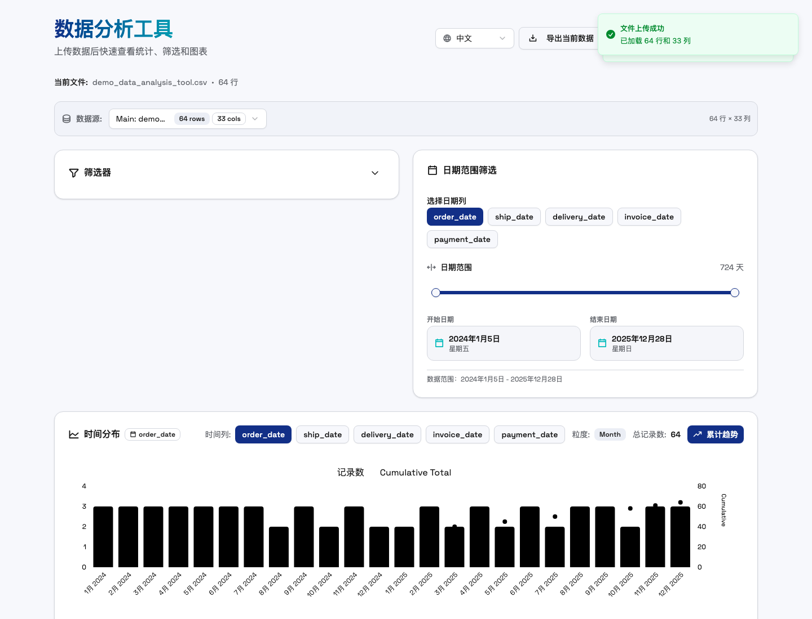
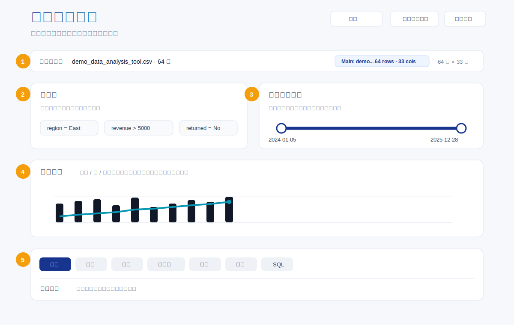
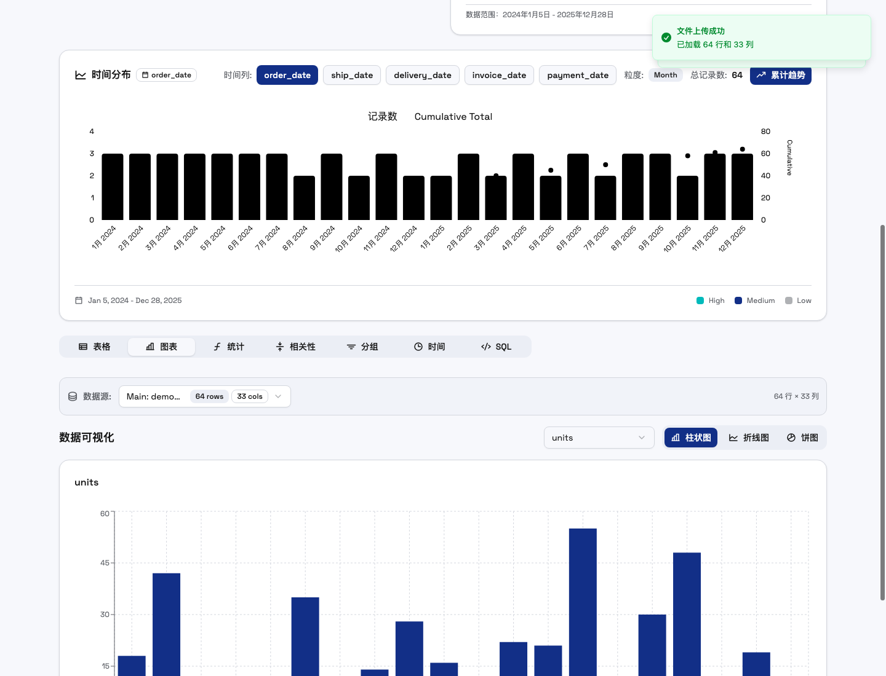
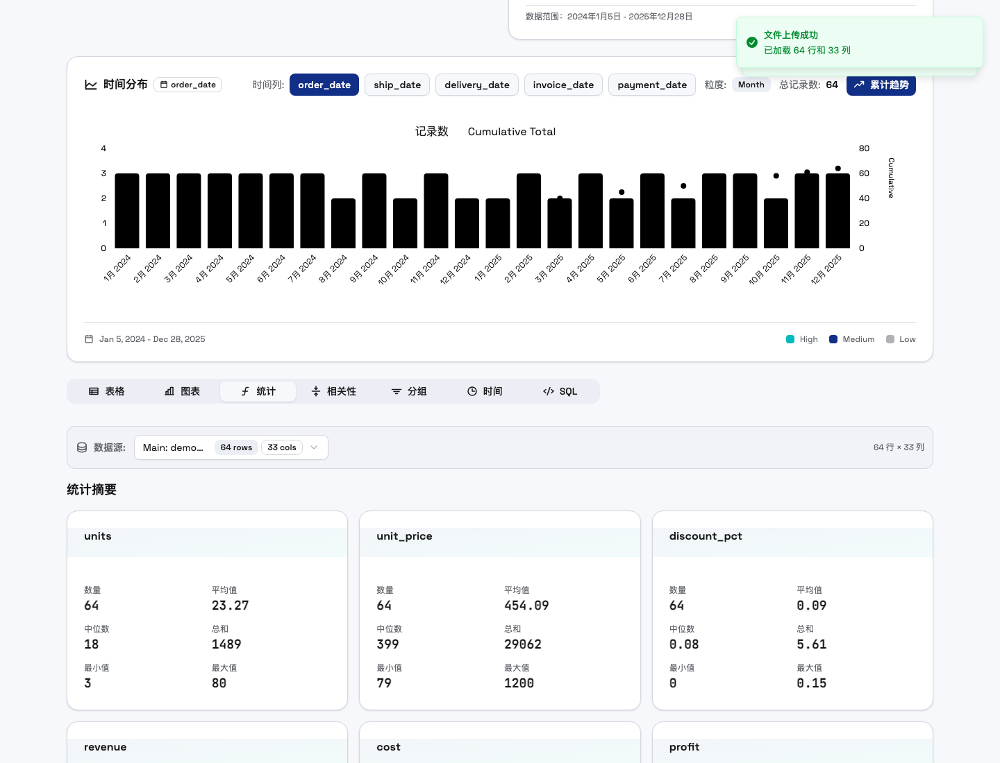
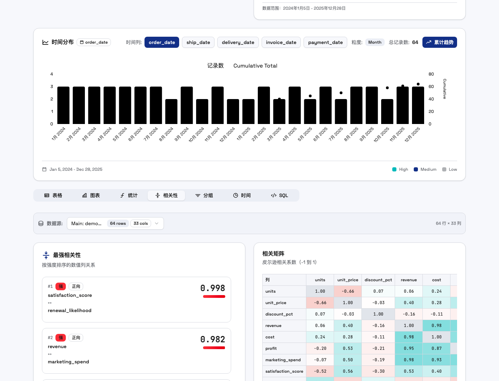
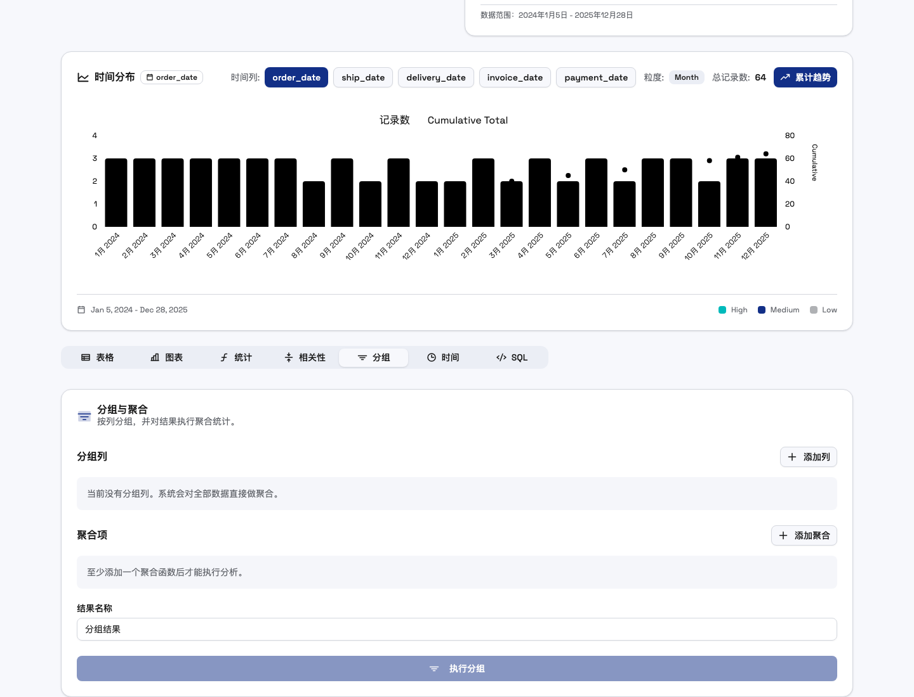
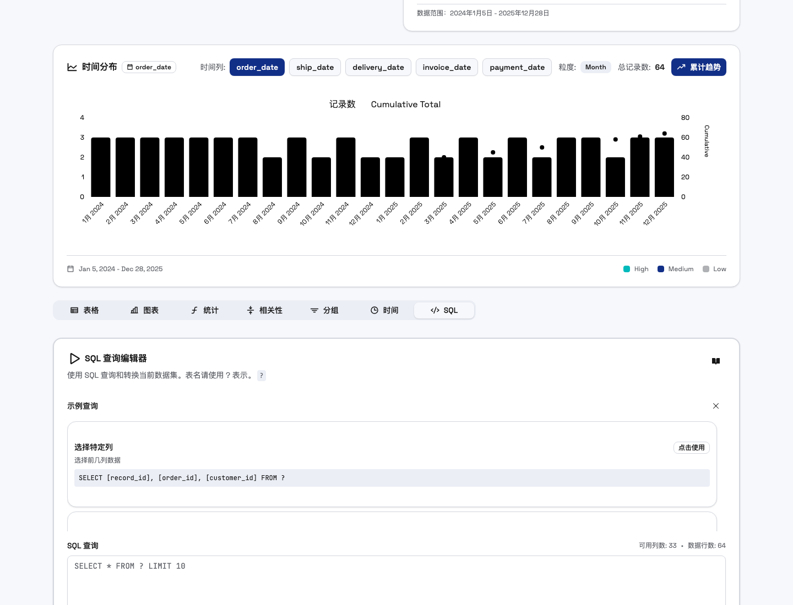
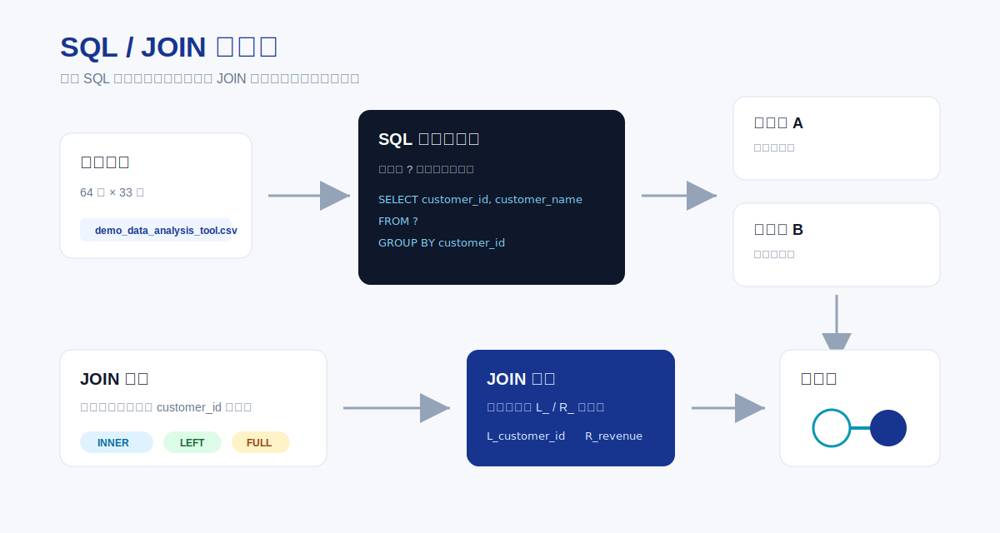
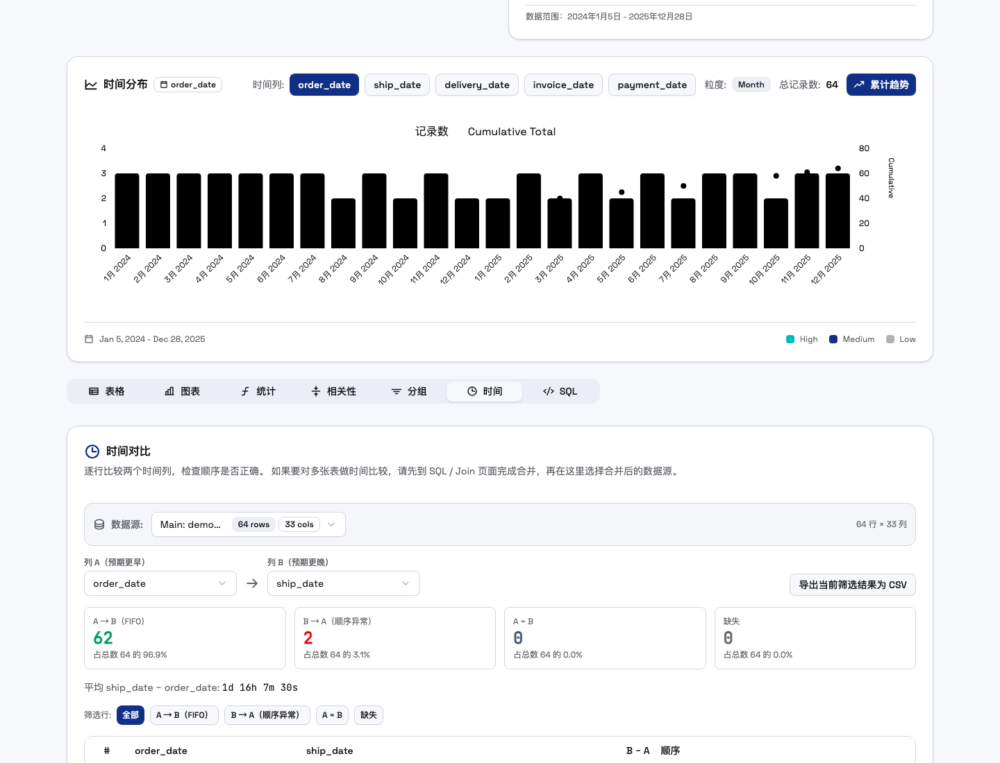
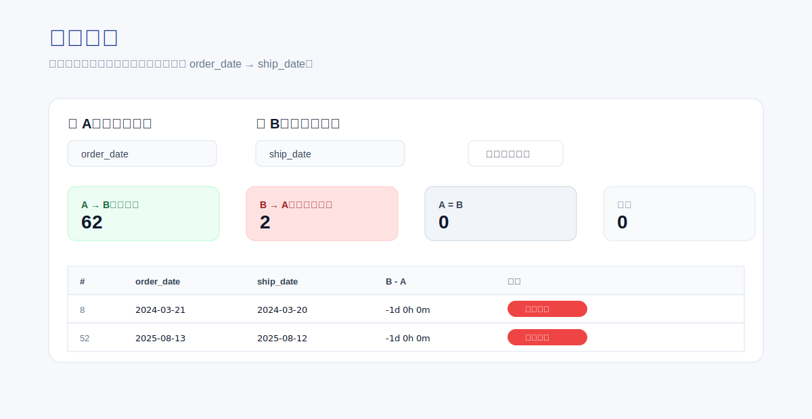

# 数据分析工具使用教程

本文档用于演示和培训。按顺序操作，可以覆盖上传、表格、筛选、图表、统计、相关性、分组、SQL、JOIN、关系图、时间对比和导出。

演示数据文件：

`data/demo_data_analysis_tool.csv`

能力清单文件：

`docs/DATA_ANALYSIS_TOOLS_AND_CAPABILITIES.md`

## 1. 启动应用

在项目根目录执行：

```bash
npm run dev
```

打开终端输出的本地地址。

通常是：

```text
http://127.0.0.1:5000/
```

如果 5000 端口被占用，Vite 会自动给出新的端口。

## 2. 上传演示数据

进入首页后，点击“选择文件”。

选择：

```text
data/demo_data_analysis_tool.csv
```

上传成功后，页面会显示：

```text
已加载 64 行和 33 列
```


## 3. 认识主工作区

上传后，页面会出现五个主要区域。





| 区域 | 用途 |
|---|---|
| 当前文件 | 查看当前数据文件名和总行数 |
| 数据源 | 切换主数据、附加文件、SQL 结果、JOIN 结果 |
| 筛选器 | 按文本、数字、日期筛选数据 |
| 日期范围筛选 | 用日期列限制时间窗口 |
| 时间分布 | 查看数据在时间上的分布和累计趋势 |
| 标签页 | 切换表格、图表、统计、相关性、分组、时间、SQL |

## 4. 表格查看

点击“表格”标签。

表格适合做三件事：

1. 核对数据是否成功加载。
2. 检查字段类型是否正确识别。
3. 按列排序或隐藏不需要的列。

常用操作：

| 操作 | 方法 |
|---|---|
| 排序 | 点击列标题 |
| 显示 / 隐藏列 | 点击“列 (33/33)” |
| 查看更多行 | 滚动表格或点击加载更多 |
| 横向查看宽表 | 使用表格底部横向滚动条 |

建议先检查这些字段：

```text
order_date
ship_date
delivery_date
revenue
profit
satisfaction_score
renewal_likelihood
returned
```

这些字段可以支撑日期分析、数值分析、相关性分析和异常检查。

## 5. 使用筛选器

点击“筛选器”卡片右侧箭头。

点击“添加筛选”。

推荐演示以下三组筛选：

| 演示目标 | 字段 | 操作符 | 值 |
|---|---|---|---|
| 查看东部区域 | `region` | 等于 | `East` |
| 查看高收入订单 | `revenue` | 大于 | `5000` |
| 查看退货订单 | `returned` | 等于 | `Yes` |

筛选器支持多个条件。

多个条件会按 AND 生效。

这不是为了做复杂配置，而是为了让业务人员一步一步缩小问题范围。

## 6. 使用日期范围筛选

在“日期范围筛选”区域选择日期列。

推荐先选择：

```text
order_date
```

拖动左右滑块，缩小到某一段时间。

点击“应用日期筛选”。

适合演示：

| 演示目标 | 操作 |
|---|---|
| 只看 2025 年订单 | 把开始日期拉到 2025-01-01 附近 |
| 看某一活动周期 | 根据 `campaign` 和日期组合筛选 |
| 看时间分布变化 | 应用日期范围后观察时间分布图粒度变化 |

## 7. 查看时间分布

时间分布图会自动读取日期列。

当前演示数据跨越 2024-01 到 2025-12。

因此默认粒度是 Month。

你可以切换这些时间列：

```text
order_date
ship_date
delivery_date
invoice_date
payment_date
```

适合讲解：

| 看什么 | 说明 |
|---|---|
| 柱状图 | 每个月记录数 |
| 累计趋势 | 总记录量随时间增长 |
| 日期列切换 | 不同业务节点的时间分布 |

## 8. 查看图表

点击“图表”标签。



图表页支持：

| 图表 | 适合场景 |
|---|---|
| 柱状图 | 比较不同记录的数值大小 |
| 折线图 | 查看数值变化趋势 |
| 饼图 | 查看前 20 行的占比结构 |

推荐选择这些数值列演示：

```text
revenue
profit
units
marketing_spend
satisfaction_score
```

说明：

基础图表默认展示前 20 行。

这不是数据缺失，而是为了避免宽表和大表拖慢页面。

## 9. 查看统计摘要

点击“统计”标签。



统计页会自动计算数值列。

每个数值列会显示：

| 指标 | 含义 |
|---|---|
| 数量 | 有效数字值数量 |
| 平均值 | 数值平均水平 |
| 中位数 | 中间位置的数值 |
| 总和 | 全部数值之和 |
| 最小值 | 最小数字 |
| 最大值 | 最大数字 |

推荐讲解字段：

```text
revenue
cost
profit
marketing_spend
satisfaction_score
renewal_likelihood
```

## 10. 查看相关性和散点回归

点击“相关性”标签。



相关性页包含两部分：

| 区域 | 用途 |
|---|---|
| 最强相关性 | 按相关强度列出 Top 10 数值列关系 |
| 相关矩阵 | 用矩阵查看所有数值列之间的 Pearson 相关系数 |

演示数据里有几组适合展示的关系：

| 字段组合 | 预期现象 |
|---|---|
| `satisfaction_score` 与 `renewal_likelihood` | 强正相关 |
| `revenue` 与 `marketing_spend` | 强正相关 |
| `revenue` 与 `profit` | 强正相关 |
| `support_tickets` 与 `satisfaction_score` | 负相关 |

继续向下看，可以看到散点图和回归线。

推荐选择：

```text
X 轴：revenue
Y 轴：profit
```

这个组合适合说明收入和利润的关系。

## 11. 分组与聚合

点击“分组”标签。



推荐演示一：按区域汇总收入。

| 设置项 | 值 |
|---|---|
| 分组列 | `region` |
| 聚合函数 | `sum` |
| 聚合列 | `revenue` |
| 输出列名 | `total_revenue` |
| 结果名称 | `按区域汇总收入` |

推荐演示二：按品类查看利润。

| 设置项 | 值 |
|---|---|
| 分组列 | `category` |
| 聚合函数 | `avg` |
| 聚合列 | `profit` |
| 输出列名 | `avg_profit` |
| 结果名称 | `按品类平均利润` |

推荐演示三：多指标聚合。

| 聚合函数 | 聚合列 | 输出列名 |
|---|---|---|
| `count` | `order_id` | `order_count` |
| `sum` | `revenue` | `total_revenue` |
| `avg` | `satisfaction_score` | `avg_satisfaction` |
| `countDistinct` | `customer_id` | `unique_customers` |

执行后，结果会进入“查询结果”列表。

分组结果也可以继续看表格、图表和统计。

## 12. SQL 查询

点击“SQL”标签。



SQL 里当前数据集用 `?` 表示。

推荐先跑这个查询：

```sql
SELECT
  region,
  category,
  SUM(revenue) AS total_revenue,
  AVG(profit) AS avg_profit,
  COUNT(*) AS orders
FROM ?
GROUP BY region, category
ORDER BY total_revenue DESC
```

继续演示筛选：

```sql
SELECT
  order_id,
  customer_name,
  region,
  product_name,
  revenue,
  profit
FROM ?
WHERE revenue > 8000
ORDER BY revenue DESC
```

继续演示异常订单：

```sql
SELECT
  order_id,
  customer_name,
  order_date,
  ship_date,
  returned,
  support_tickets,
  satisfaction_score
FROM ?
WHERE returned = 'Yes'
ORDER BY support_tickets DESC
```

## 13. JOIN 演示

JOIN 需要至少两个已保存查询结果。

先在 SQL 里生成客户维度表：

```sql
SELECT DISTINCT
  customer_id,
  customer_name,
  segment,
  region
FROM ?
```

再生成订单事实表：

```sql
SELECT
  order_id,
  customer_id,
  order_date,
  product_name,
  revenue,
  profit
FROM ?
```

然后进入 JOIN 面板。

设置：

| 设置项 | 值 |
|---|---|
| 左表 | 客户维度表 |
| 右表 | 订单事实表 |
| 左关联列 | `customer_id` |
| 右关联列 | `customer_id` |
| JOIN 类型 | `INNER JOIN` |

执行后，会生成合并结果。

合并字段会自动加前缀：

```text
L_customer_id
R_customer_id
R_revenue
R_profit
```



## 14. 关系图

执行 JOIN 后，SQL 页底部会出现关系图。

关系图用于解释：

| 元素 | 含义 |
|---|---|
| 白色节点 | 原始查询结果表 |
| 蓝色节点 | JOIN 结果表 |
| 连线 | JOIN 关系 |
| 连线标签 | JOIN 类型 |

可以拖拽节点。

可以缩放和平移图。

悬浮节点可以查看字段。

点击有关联的字段，可以高亮对应连线。

## 15. 时间对比

点击“时间”标签。



推荐演示：

| 设置项 | 值 |
|---|---|
| 列 A（预期更早） | `order_date` |
| 列 B（预期更晚） | `ship_date` |

演示数据里故意放了两条异常记录：

| 记录 | 异常 |
|---|---|
| `ORD-1008` | `ship_date` 早于 `order_date` |
| `ORD-1052` | `ship_date` 早于 `order_date` |

时间对比会把结果分成四类：

| 状态 | 含义 |
|---|---|
| A → B | 时间顺序正常 |
| B → A | 顺序异常 |
| A = B | 两个时间相同 |
| 缺失 | 至少一个时间为空 |



## 16. 导出结果

应用支持三类导出：

| 导出位置 | 导出内容 |
|---|---|
| 顶部“导出当前数据” | 当前数据源 |
| 查询结果卡片导出按钮 | SQL、分组、JOIN 结果 |
| 时间对比页导出按钮 | 当前时间对比筛选结果 |

导出格式是 CSV。

导出后可以发给同事，也可以继续用 Excel 处理。

## 17. 推荐演示流程

按下面顺序讲，最顺。

1. 上传 `data/demo_data_analysis_tool.csv`。
2. 介绍主工作区和数据源。
3. 进入表格页，说明字段类型和列选择。
4. 添加筛选：`region = East`。
5. 添加筛选：`revenue > 5000`。
6. 选择 `order_date` 做日期范围筛选。
7. 看时间分布图。
8. 切到图表页，选择 `revenue`。
9. 切到统计页，解释收入、利润、满意度。
10. 切到相关性页，解释强相关关系。
11. 切到分组页，按 `region` 汇总 `revenue`。
12. 切到 SQL 页，运行分组 SQL。
13. 生成两个 SQL 结果，演示 JOIN。
14. 查看关系图。
15. 切到时间页，演示 `order_date` 和 `ship_date` 顺序异常。
16. 导出当前结果。

## 18. 重新生成教程截图

截图脚本已经放在：

```text
scripts/capture-tutorial-screenshots.mjs
```

先启动本地应用：

```bash
node node_modules/vite/bin/vite.js --host 127.0.0.1 --port 5001 --configLoader runner
```

如果 Vite 自动换到 5002，就这样生成截图：

```bash
APP_URL=http://127.0.0.1:5002/ node scripts/capture-tutorial-screenshots.mjs
```

如果页面运行在 5001，可以直接执行：

```bash
node scripts/capture-tutorial-screenshots.mjs
```

截图会写入：

```text
docs/assets/tutorial/
```

脚本会自动上传演示 CSV，并重新生成上传页、主界面、图表、统计、相关性、分组、时间和 SQL 页面截图。

## 19. 录屏脚本

如果需要录制视频，可以按这个节奏录。

| 时间 | 内容 |
|---|---|
| 0:00 - 0:30 | 介绍工具用途和演示数据 |
| 0:30 - 1:10 | 上传 CSV，说明 64 行 33 列 |
| 1:10 - 2:00 | 表格、字段类型、筛选器 |
| 2:00 - 2:40 | 日期范围和时间分布 |
| 2:40 - 3:30 | 图表、统计、相关性 |
| 3:30 - 4:30 | 分组聚合和 SQL 查询 |
| 4:30 - 5:20 | JOIN 和关系图 |
| 5:20 - 6:00 | 时间对比和导出 |

## 20. 常见问题

| 问题 | 处理方式 |
|---|---|
| 上传后没有统计 | 检查数据里是否有数值列 |
| 图表只显示部分数据 | 基础图表默认展示前 20 行 |
| 分组图没有出现 | 先执行一次分组聚合 |
| JOIN 面板不可用 | 先保存至少两个 SQL 或分组结果 |
| 时间页不可用 | 数据集至少需要两个日期列 |
| 导出的 CSV 打开乱码 | 用支持 UTF-8 的表格软件打开 |

## 21. 演示数据字段说明

| 字段 | 用途 |
|---|---|
| `order_id` | 订单编号 |
| `customer_id` | 客户编号，支持 JOIN |
| `customer_name` | 客户名称 |
| `segment` | 客户分层 |
| `region` | 区域分组 |
| `product_name` | 产品名称 |
| `category` | 产品品类 |
| `order_date` | 下单日期 |
| `ship_date` | 发货日期 |
| `delivery_date` | 送达日期 |
| `invoice_date` | 开票日期 |
| `payment_date` | 付款日期 |
| `units` | 数量 |
| `unit_price` | 单价 |
| `discount_pct` | 折扣比例 |
| `revenue` | 收入 |
| `cost` | 成本 |
| `profit` | 利润 |
| `marketing_spend` | 市场费用 |
| `satisfaction_score` | 满意度 |
| `support_tickets` | 支持工单数 |
| `renewal_likelihood` | 续约可能性 |
| `returned` | 是否退货 |
| `warehouse_id` | 仓库编号 |
| `supplier_id` | 供应商编号 |
| `campaign` | 营销活动 |
